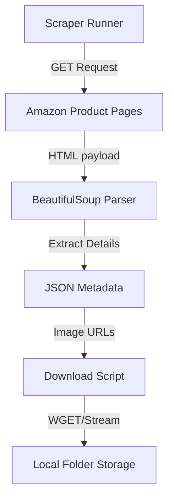

<div align="center">

# 🕷️ AmazonScraper

### High-Speed Python Web Scraper · Automatic Image Downloader

[](https://python.org)
[](https://www.crummy.com/software/BeautifulSoup/)
[](https://requests.readthedocs.io/)
[](LICENSE)

**AmazonScraper** is a high-speed Python script utility configured to automatically extract product data, ASINs, reviews, and high-resolution images from Amazon pages. Designed for data analysis, price comparison, or machine learning datasets.

*Automatic Multi-Category Downloading · Session Retention · Image Directory Mapping*

</div>

---

## ✨ Key Features

| Feature | Description |
|---------|-------------|
| 🕷️ **Asynchronous Requests** | Scrapes product items across catalog lists without triggering browser blockers. |
| 🖼️ **Image Downloader** | Automatically downloads catalog thumbnail arrays and maps them to local subdirectory assets. |
| 📊 **Clean Output Mapping** | Saves product metadata structured by Category (Electronics, Air Conditioners, etc.). |
| 🔒 **User-Agent Rotation** | Simulates regular user agent contexts to retrieve consistent server responses. |

---

## 🧱 Tech Stack

| Component | Technology |
|-----------|------------|
| 🐍 **Script Language** | Python 3 |
| 🌐 **HTTP Engine** | Requests (with cookies/header simulation) |
| 📝 **Parser** | BeautifulSoup4 / HTML Parser |
| 📁 **Storage** | Local structured folders (`/images`) |

---

## ⚙️ Getting Started

### Prerequisites
* **Python** 3.8+
* **pip** library manager

### Installation & Execution

```bash
# 1. Clone the repository
git clone https://github.com/ParthaG23/AmazonScraper.git
cd AmazonScraper

# 2. Install dependencies
pip install requests beautifulsoup4

# 3. Run the scraping script
python amazonScraper.py

# 4. Download media assets
python downloadImages.py
```

---

## 🏗️ Architecture



---

## 🧑‍💻 Author

**Partha Gayen**

[](https://github.com/ParthaG23)
[](https://www.linkedin.com/in/partha-gayen)

---

## 📜 License

This project is licensed under the **MIT License**.
